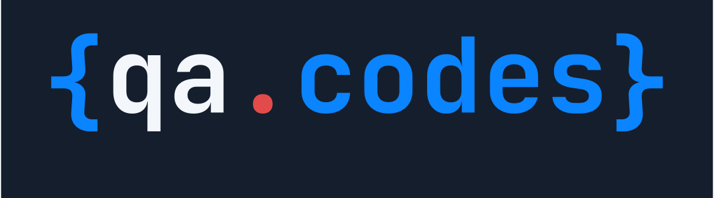
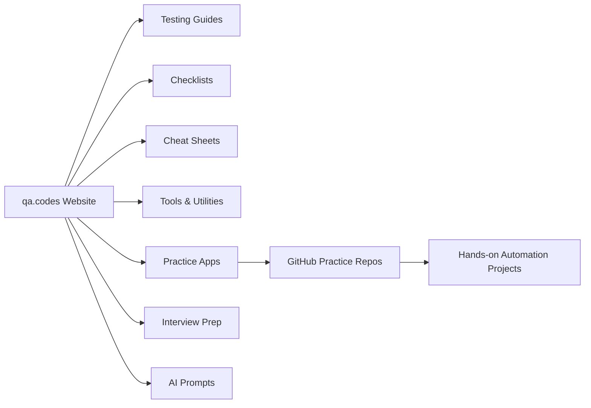
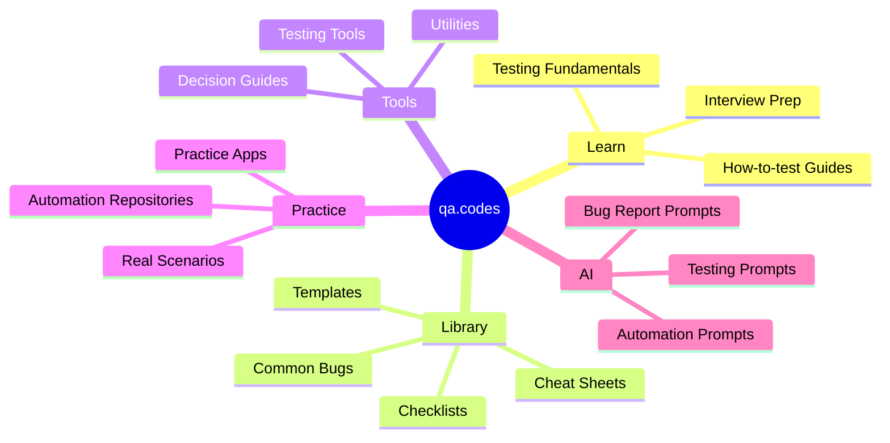
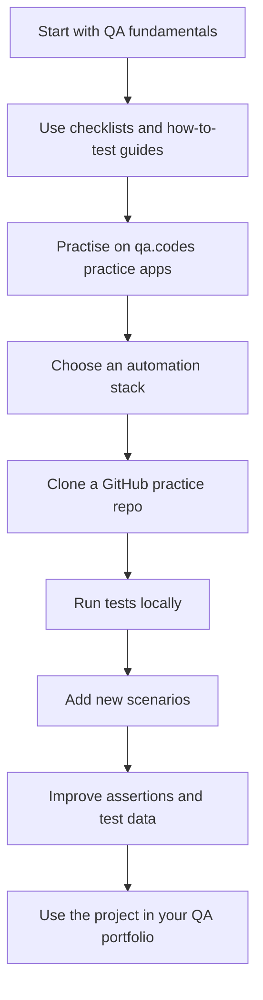

 
 

### Practical software testing resources, tools, examples, and practice projects for QA engineers, software testers, SDETs, and automation engineers.

 

 

**Learn testing. Practise with real examples. Build QA confidence.**

---

## What is qa.codes?

**qa.codes** is a practical software testing resource hub built for testers who want to improve their skills through real-world examples, checklists, guides, utilities, and practice projects.

It is designed to help you move from theory to practical QA work.

---

## Who is qa.codes for?

| Audience | How qa.codes helps |
|---|---|
| Manual QA testers | Learn practical testing techniques, checklists, and bug patterns |
| Automation testers | Practise Playwright, Cypress, Selenium, API testing, and BDD |
| SDETs | Explore framework structure, CI-ready examples, and reusable patterns |
| Junior testers | Build confidence with guided examples and practice apps |
| Interview candidates | Prepare with practical QA interview resources |
| QA leads | Use templates, checklists, and process resources |
| Developers | Understand how testers approach quality and coverage |

---

## Practice repositories

This GitHub organisation hosts hands-on repositories connected to the learning content on **qa.codes**.

**Web & UI automation**

| Repository | Focus | Stack |
|---|---|---|
| [`qacodes-playwright-typescript`](https://github.com/qacodes-dev/qacodes-playwright-typescript) | Modern E2E web automation | Playwright, TypeScript |
| [`qacodes-cypress-typescript`](https://github.com/qacodes-dev/qacodes-cypress-typescript) | Frontend E2E automation | Cypress, TypeScript |
| [`qacodes-selenium-java`](https://github.com/qacodes-dev/qacodes-selenium-java) | Selenium automation framework | Selenium WebDriver, Java |
| [`qacodes-webdriverio-typescript`](https://github.com/qacodes-dev/qacodes-webdriverio-typescript) | E2E automation with Allure reporting | WebdriverIO, TypeScript |
| [`qacodes-playwright-python-pytest`](https://github.com/qacodes-dev/qacodes-playwright-python-pytest) | E2E automation with pytest | Playwright, Python, pytest |
| [`qacodes-robot-framework-selenium`](https://github.com/qacodes-dev/qacodes-robot-framework-selenium) | Keyword-driven UI automation | Robot Framework, SeleniumLibrary |
| [`qacodes-playwright-framework-template`](https://github.com/qacodes-dev/qacodes-playwright-framework-template) | Production-structured framework template | Playwright, TypeScript |

**BDD**

| Repository | Focus | Stack |
|---|---|---|
| [`qacodes-playwright-typescript-cucumber-bdd`](https://github.com/qacodes-dev/qacodes-playwright-typescript-cucumber-bdd) | BDD-style UI automation | Playwright, TypeScript, Cucumber |
| [`qacodes-karate-api-automation`](https://github.com/qacodes-dev/qacodes-karate-api-automation) | BDD-style API testing | Karate |

**API & contract testing**

| Repository | Focus | Stack |
|---|---|---|
| [`qacodes-rest-assured-api-automation`](https://github.com/qacodes-dev/qacodes-rest-assured-api-automation) | API automation testing | REST Assured, Java |
| [`qacodes-postman-newman-api`](https://github.com/qacodes-dev/qacodes-postman-newman-api) | API testing in CI with Newman | Postman, Newman |
| [`qacodes-bruno-api-collection`](https://github.com/qacodes-dev/qacodes-bruno-api-collection) | Git-native API testing | Bruno |
| [`qacodes-pact-contract-testing`](https://github.com/qacodes-dev/qacodes-pact-contract-testing) | Consumer-driven contract testing | Pact, TypeScript |

**Performance & load**

| Repository | Focus | Stack |
|---|---|---|
| [`qacodes-k6-performance-testing`](https://github.com/qacodes-dev/qacodes-k6-performance-testing) | Performance & load testing | k6, JavaScript |
| [`qacodes-gatling-load-testing`](https://github.com/qacodes-dev/qacodes-gatling-load-testing) | Load & stress testing | Gatling, Scala |

**CI / CD**

| Repository | Focus | Stack |
|---|---|---|
| [`qacodes-github-actions-ci-pipeline`](https://github.com/qacodes-dev/qacodes-github-actions-ci-pipeline) | Reference CI pipeline for test automation | GitHub Actions |

---

**AI for QA — Starter Projects**

Runnable, cloneable AI-for-QA projects: move from copy-and-paste examples to
**clone → configure → run → extend**. Hub: [qa.codes/ai/starter-projects](https://qa.codes/ai/starter-projects).

_Content libraries & runnable starters_

| Repository | Focus | Stack |
|---|---|---|
| [`qacodes-agent-skills-starter`](https://github.com/qacodes-dev/qacodes-agent-skills-starter) | Reusable QA Agent Skills (SKILL.md) | Node, TypeScript |
| [`qacodes-ai-qa-prompt-packs`](https://github.com/qacodes-dev/qacodes-ai-qa-prompt-packs) | Version-controlled QA prompt packs | Node, Markdown |
| [`qacodes-playwright-mcp-testing`](https://github.com/qacodes-dev/qacodes-playwright-mcp-testing) | Playwright + MCP failure-analysis workflow | Node, Playwright, MCP |
| [`qacodes-mcp-qa-starter`](https://github.com/qacodes-dev/qacodes-mcp-qa-starter) | Safe MCP configs & QA workflows | Node, JSON |
| [`qacodes-rag-for-qa-starter`](https://github.com/qacodes-dev/qacodes-rag-for-qa-starter) | Local RAG over synthetic QA docs | Python |

_Evaluation suites_

| Repository | Focus | Stack |
|---|---|---|
| [`qacodes-llm-chatbot-testing`](https://github.com/qacodes-dev/qacodes-llm-chatbot-testing) | Evaluate AI chatbots (safety, hallucination, tone) | Python |
| [`qacodes-rag-evaluation-suite`](https://github.com/qacodes-dev/qacodes-rag-evaluation-suite) | Measure a RAG (precision, groundedness) | Python |
| [`qacodes-prompt-regression-testing`](https://github.com/qacodes-dev/qacodes-prompt-regression-testing) | Prompt format/hallucination + model regression | Python |

_Reference architecture & toolkit_

| Repository | Focus | Stack |
|---|---|---|
| [`qacodes-ai-release-risk-agent`](https://github.com/qacodes-dev/qacodes-ai-release-risk-agent) | Agentic release-risk go/no-go (human-owned) | Python |
| [`qacodes-ai-testing-toolkit`](https://github.com/qacodes-dev/qacodes-ai-testing-toolkit) | Catalogue + CLI + shared rubrics/templates | Node, TypeScript |

---

## What you can practise here

| Area | Skills you can build |
|---|---|
| Web automation | Locators, assertions, page objects, fixtures, reusable helpers |
| API testing | Requests, responses, status codes, schemas, authentication, negative scenarios |
| BDD testing | Feature files, scenarios, step definitions, readable test flows |
| Contract testing | Consumer contracts, provider verification, brokers, can-i-deploy gates |
| Performance testing | Load profiles, virtual users, thresholds, latency percentiles, CI reports |
| CI/CD | Pipelines, matrix runs, artifacts, HTML reports, flaky-test retries |
| Framework design | Folder structure, config, test data, reporting, maintainability |
| Debugging | Screenshots, traces, logs, failed assertions, flaky test investigation |
| Portfolio building | Realistic QA projects you can explain in interviews |

---

## qa.codes learning ecosystem

---

## Suggested learning path

Start with the website, then practise using GitHub repositories.

---

## Recommended starting points

| Goal | Start here |
|---|---|
| Learn modern web automation | [`qacodes-playwright-typescript`](https://github.com/qacodes-dev/qacodes-playwright-typescript) |
| Practise Cypress | [`qacodes-cypress-typescript`](https://github.com/qacodes-dev/qacodes-cypress-typescript) |
| Practise Java Selenium | [`qacodes-selenium-java`](https://github.com/qacodes-dev/qacodes-selenium-java) |
| Learn API automation with Java | [`qacodes-rest-assured-api-automation`](https://github.com/qacodes-dev/qacodes-rest-assured-api-automation) |
| Learn BDD-style API testing | [`qacodes-karate-api-automation`](https://github.com/qacodes-dev/qacodes-karate-api-automation) |
| Combine Playwright with Cucumber | [`qacodes-playwright-typescript-cucumber-bdd`](https://github.com/qacodes-dev/qacodes-playwright-typescript-cucumber-bdd) |
| Run Postman collections in CI | [`qacodes-postman-newman-api`](https://github.com/qacodes-dev/qacodes-postman-newman-api) |
| Try consumer-driven contract testing | [`qacodes-pact-contract-testing`](https://github.com/qacodes-dev/qacodes-pact-contract-testing) |
| Run performance & load tests | [`qacodes-k6-performance-testing`](https://github.com/qacodes-dev/qacodes-k6-performance-testing) |
| Load-test with Gatling | [`qacodes-gatling-load-testing`](https://github.com/qacodes-dev/qacodes-gatling-load-testing) |
| Build a CI pipeline for automated tests | [`qacodes-github-actions-ci-pipeline`](https://github.com/qacodes-dev/qacodes-github-actions-ci-pipeline) |
| Explore AI for QA | [`qacodes-ai-testing-toolkit`](https://github.com/qacodes-dev/qacodes-ai-testing-toolkit) |
| Build a local RAG for QA | [`qacodes-rag-for-qa-starter`](https://github.com/qacodes-dev/qacodes-rag-for-qa-starter) |
| Test an AI chatbot | [`qacodes-llm-chatbot-testing`](https://github.com/qacodes-dev/qacodes-llm-chatbot-testing) |
| Assess release risk with an agent | [`qacodes-ai-release-risk-agent`](https://github.com/qacodes-dev/qacodes-ai-release-risk-agent) |

---

## Content areas on qa.codes

| Category | Includes |
|---|---|
| Testing foundations | Manual testing, regression, smoke, exploratory, bug reporting |
| Automation testing | Playwright, Cypress, Selenium, BDD, framework design |
| API testing | REST APIs, schemas, authentication, validation, negative testing |
| QA resources | Checklists, cheat sheets, templates, common bugs |
| Practice | Practice apps, real scenarios, automation repositories |
| Career | Interview prep, QA portfolio ideas, practical examples |
| Modern QA | Accessibility, security, performance, AI for testing |

---

## Repository goals

The repositories in this organisation aim to be:

- Practical
- Beginner-friendly
- Easy to run locally
- Useful for interview preparation
- Suitable for QA portfolio projects
- Close to real-world automation structure
- Clear enough to understand, extend, and improve

---

## Contributing ideas

Contributions, suggestions, and improvements are welcome.

Good contribution ideas include:

- Add new test scenarios
- Improve README files
- Add missing assertions
- Improve test data
- Add CI examples
- Improve framework structure
- Add reporting examples
- Report issues in practice projects
- Suggest new practice repositories

---

## Connect

 

**Built for the QA community.**

